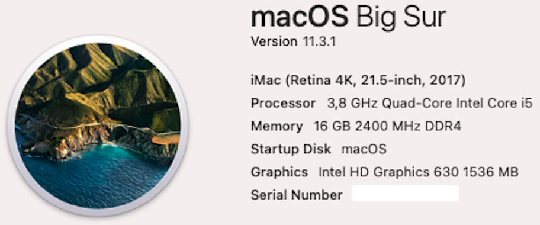
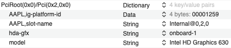
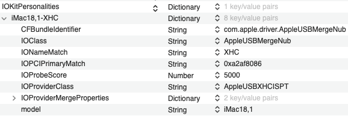

# MSI-B250M-PRO-VDH-i5-7600K
 

  
 

  

  
 

 

  
 

 
 ## Specs
 | **Component** | **Model** |
| ------------- | --------- |
| CPU | i5-7600K |
| RAM | DDR4 16GB (4x4GB) 2400MHz |
| Audio Chipset | Realtek ALC887. Works with layout-id 1 |
| dGPU | GeForce GT 710. Works OOB |
| iGPU | Intel HD Graphics 630 |
| Lan |  Realtek 8111H Gigabit LAN controller |
| WiFi | Fenvi T919. Works OOB |
| OS Disk | 256GB Samsung 850 Pro SATA |
| macOS | Big Sur 11.6/OpenCore 0.7.3

## BIOS
| **Setting** | **Value** |
| ------------- | --------- |
| Above 4G memory | Enabled |
| Initial Graphics Adapter | PEG if dGPU or IGD if iGPU |
| Intergrated Graphics Share Memory | 64M |
| Thunderbolt Support | Enabled |
| SATA Mode | AHCI Mode |
| Intel Serial I/O | Disabled |
| XHCI Hand-off | Enabled |
| Legacy USB Support | Auto |
| Serial (COM) Port0 | Disabled |
| Parallel(LTP) Port | Disabled |
| Windows 8.1/10 WHQL Support | Enabled |
| Windows 7 Installation | Disabled |
| MSI Fast Boot | Disabled |
| Fast Boot | Disabled |
| Intel VT-D Tech | Enabled |
| C1E Support | Enabled |
| CFG Lock | Disabled |

## USB config
Because XhciPortLimit kernel quirk no longer works on the latest Big Sur 11.3.x, we are left with 15 ports max. I have made a custom USBPorts.kext where I adjusted USB-A 3.0 ports on the back plane to be 5GB only. USB 2.0 devices will not work in them. USB-C port works with 3.0 and 2.0 devices. Motherboard USB3.0 header works with both USB3.0 and 2.0 devices. All 6 USB2.0 ports (2 on the back and 4 on the Motherboard hearders) work.
 

  
 

 

  
 

## iGPU only system
If you don't have any supported dGPU, you can run only on internal Intel graphics. In my case it is HD 630 with device id 00001259.

SMBIOS section in config.plist should be updated to iMac18,1. New serial/UUID/MLB should be generated.

Boot arguments should be -v slide=0 igfxonln=1

USBPorts.kext kext should also be updated to change Mac model to iMac18,1
 

  
 

  

  
 

