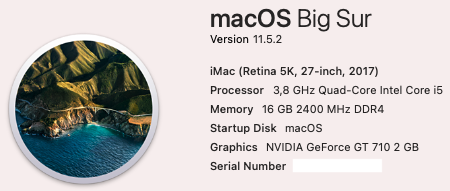
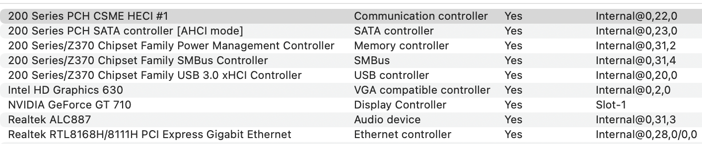
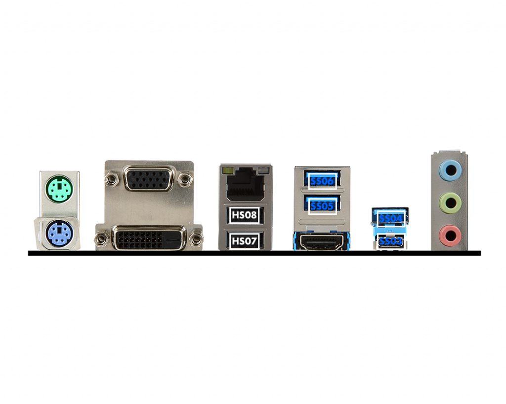
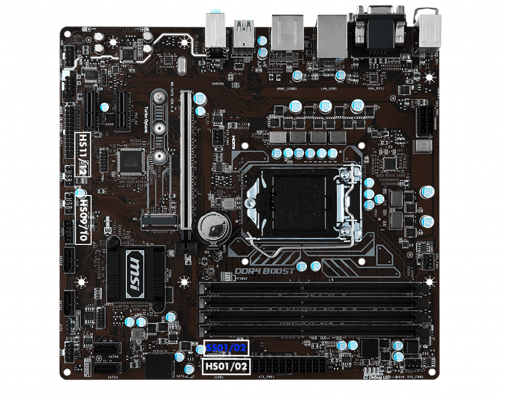

# MSI-B250M-PRO-VDH-i5-7600K
 

  
 

 

  
 

 
 ## Specs
 | **Component** | **Model** |
| ------------- | --------- |
| CPU | i5-7600K |
| RAM | DDR4 16GB (4x4GB) 2400MHz |
| Audio Chipset | Realtek ALC887. Works with layout-id 1 |
| dGPU | GeForce GT 710. Works OOB |
| iGPU | Intel UHD Graphics 630 |
| Lan |  Realtek 8111H Gigabit LAN controller |
| OS Disk | 256GB Samsung 850 Pro SATA |
| macOS | Big Sur 11.3.1/OpenCore 0.6.9

## BIOS
| ------------- | --------- |
| SATA Mode | AHCI Mode |
| Intel Serial I/O | Disabled |
| Initial Graphics Adapter | PEG |
| Intergrated Graphics Share Memory | 128M |
| Thunderbolt Support | Enabled |
| Thunderbolt Usb Support | Enabled |

## USB config
Because XhciPortLimit kernel quirk no longer works on the latest Big Sur 11.3.x, we are left with 15 ports max. I have adjusted USB-A 3.0 ports on the back plane to be 5GB only. USB 2.0 devices will not work in them. USB-C port works with 3.0 and 2.0 devices. Motherboard USB3.0 header works with both USB3.0 and 2.0 devices. All 6 USB2.0 ports work.
 

  
 

 

  
 
